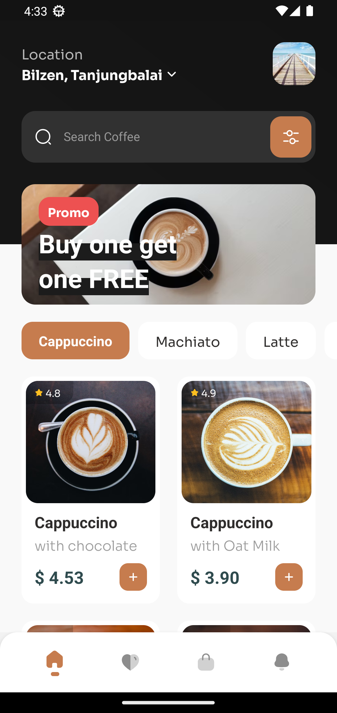
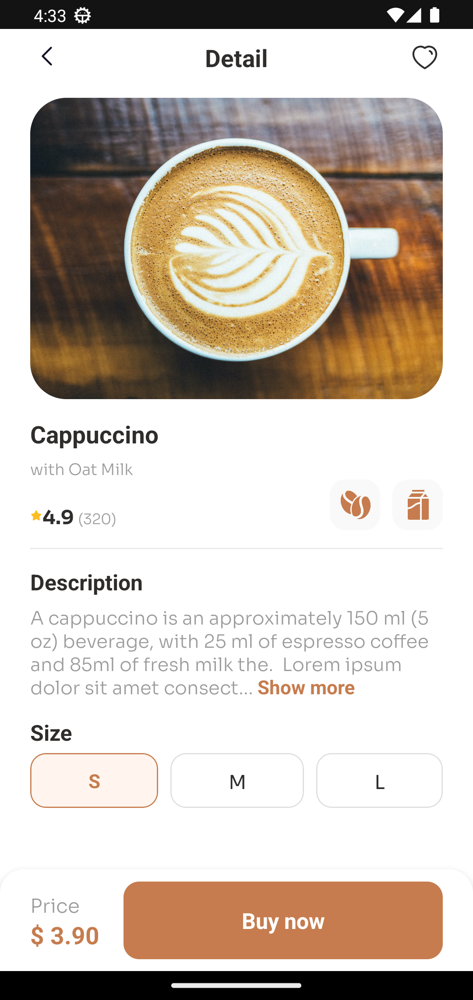
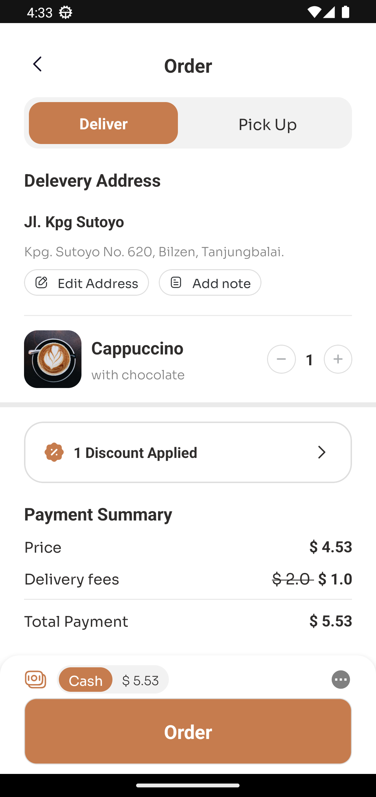
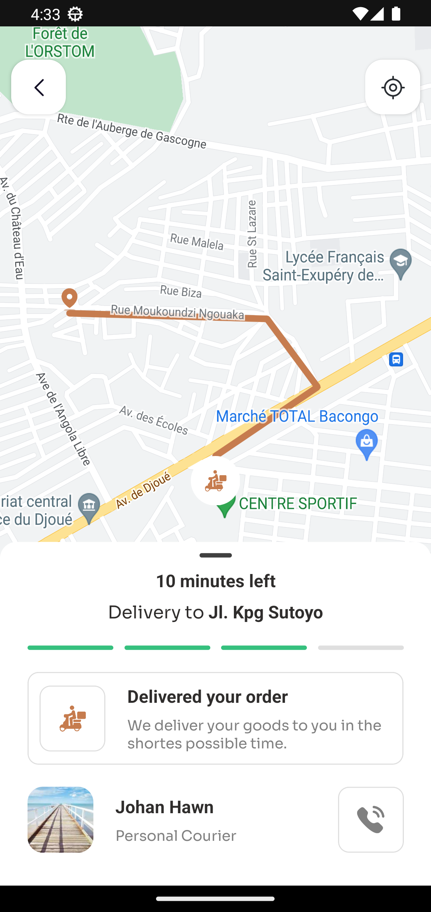

# Coffee Shop UI

Coffe shop UI inspired by this [figma design](https://www.figma.com/file/rRB066Ad3QraKyOSRFhoOq/Coffee-Shop-Mobile-App-Design-(Community)?node-id=0%3A1&mode=dev)

Project, bootstrapped using [`@react-native-community/cli`](https://github.com/react-native-community/cli).


# Demo
[demo.webm](https://github.com/declaudefrancois/rn-ui-collection/assets/81987699/f71fa2a8-5d01-4c05-97a1-0ec06fa6c6b6)


# Screenshots

## onboarding


## Home


## Coffee Details


## order


## order delivery (map)


# Getting Started

>**Note**: Make sure you have completed the [React Native - Environment Setup](https://reactnative.dev/docs/environment-setup) instructions till "Creating a new application" step, before proceeding.

## Step 0: Add Android `secrets.properties` file

Create a file named `secrets.properties` in the `android` directory of your project with the following contents:
```
GOOGLE_MAPS_API_KEY=<your-google-maps-api-key>
```

## Step 1: Start the Metro Server

First, you will need to start **Metro**, the JavaScript _bundler_ that ships _with_ React Native.

To start Metro, run the following command from the _root_ of your React Native project:

```bash
# using npm
npm start

# OR using Yarn
yarn start
```

## Step 2: Start your Application

Let Metro Bundler run in its _own_ terminal. Open a _new_ terminal from the _root_ of your React Native project. Run the following command to start your _Android_ or _iOS_ app:

### For Android

```bash
# using npm
npm run android

# OR using Yarn
yarn android
```

### For iOS

```bash
# using npm
npm run ios

# OR using Yarn
yarn ios
```

If everything is set up _correctly_, you should see your new app running in your _Android Emulator_ or _iOS Simulator_ shortly provided you have set up your emulator/simulator correctly.

This is one way to run your app — you can also run it directly from within Android Studio and Xcode respectively.
